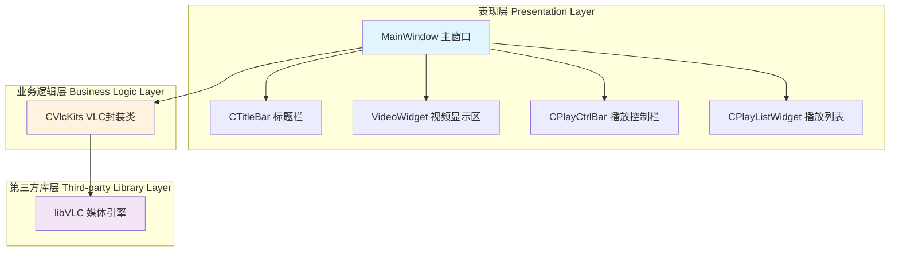
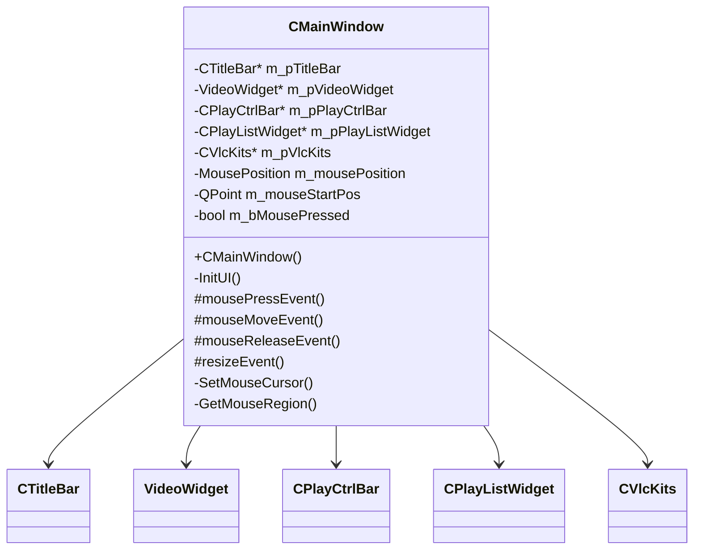
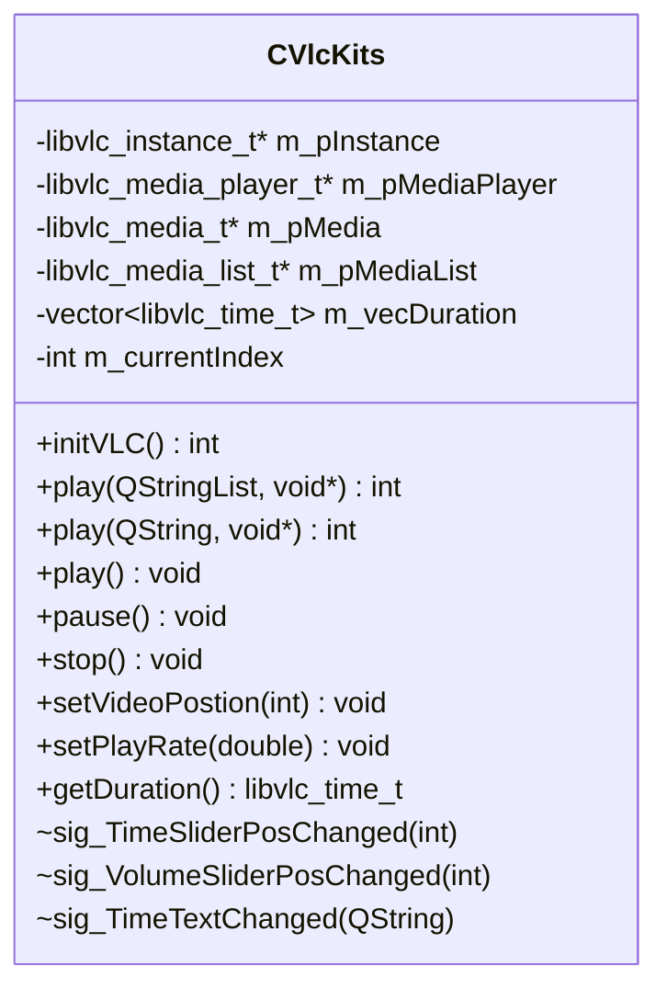
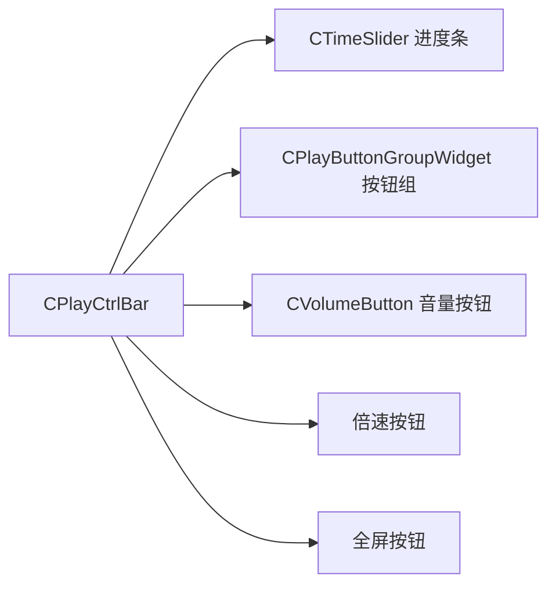
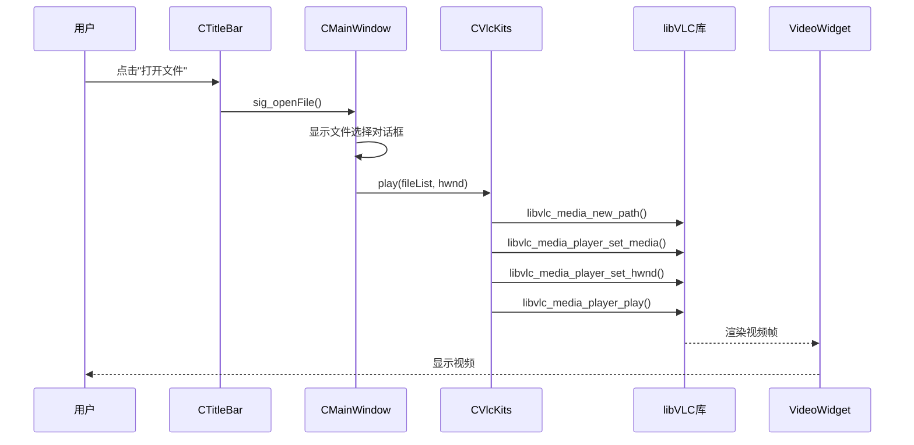
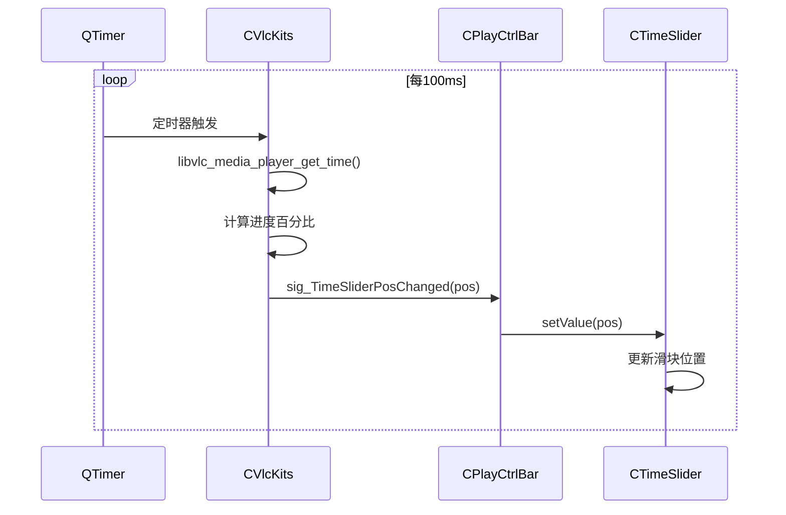

# QQMediaPlayerCopy 架构设计文档

## 📋 文档信息

- **项目名称**: QQMediaPlayerCopy
- **版本**: 1.0.0
- **作者**: muyu147
- **最后更新**: 2026-01-22

---

## 🎯 项目概述

### 项目简介
QQMediaPlayerCopy 是一个基于 Qt 和 libVLC 的跨平台音视频播放器，模仿 QQ 影音的界面和功能。项目采用模块化设计，支持多种视频格式和网络流播放。

### 技术栈
- **UI 框架**: Qt 6.3.0 (C++)
- **媒体引擎**: libVLC 3.0.8
- **开发环境**: Visual Studio 2022
- **平台**: Windows 11 x64

### 核心功能
- ✅ 本地视频文件播放（mp4, avi, flv等）
- ✅ 网络流播放（http, rtsp, rtmp）
- ✅ 播放列表管理
- ✅ 播放控制（播放/暂停/停止/上一首/下一首）
- ✅ 进度条拖拽
- ✅ 音量控制
- ✅ 倍速播放（0.5x ~ 2.0x）
- ✅ 全屏模式
- ✅ 自定义无边框窗口
- ✅ 窗口拖拽和缩放

---

## 🏗️ 系统架构

### 整体架构图



### 分层说明

#### 1. 表现层（Presentation Layer）
负责用户界面的展示和用户交互

- **MainWindow**: 主窗口容器，管理所有子组件
- **CTitleBar**: 自定义标题栏，包含菜单和窗口控制按钮
- **VideoWidget**: 视频渲染区域，接收 libVLC 的视频输出
- **CPlayCtrlBar**: 播放控制栏，包含播放按钮、进度条、音量控制等
- **CPlayListWidget**: 播放列表管理界面

#### 2. 业务逻辑层（Business Logic Layer）
封装媒体播放的核心逻辑

- **CVlcKits**: libVLC 的 C++ 封装类，提供面向对象的接口

#### 3. 第三方库层（Third-party Library Layer）
底层媒体处理引擎

- **libVLC**: VideoLAN 提供的跨平台媒体播放库

---

## 📦 模块设计

### 1. MainWindow（主窗口模块）

#### 职责
- 管理所有子组件的生命周期
- 处理窗口事件（拖拽、缩放、全屏）
- 协调各模块之间的通信

#### 类图


#### 核心功能实现

**1. 无边框窗口实现**
```cpp
// MainWindow.cpp
CMainWindow::CMainWindow(QWidget *parent)
    : QWidget(parent)
{
    // 设置无边框窗口
    setWindowFlags(Qt::FramelessWindowHint);

    // 设置最小尺寸
    setMinimumSize(kMinWindowWidth, kMinWindowHeight);
}
```

**2. 窗口拖拽实现**
```cpp
void CMainWindow::mousePressEvent(QMouseEvent* event)
{
    if (event->button() == Qt::LeftButton) {
        m_bMousePressed = true;
        m_mouseStartPos = event->globalPos() - this->frameGeometry().topLeft();
    }
}

void CMainWindow::mouseMoveEvent(QMouseEvent* event)
{
    if (m_bMousePressed && m_mousePosition == kMousePositionMid) {
        // 拖拽窗口
        move(event->globalPos() - m_mouseStartPos);
    }
    else if (m_bMousePressed) {
        // 缩放窗口（根据鼠标位置）
        ResizeWindow(event->globalPos());
    }
}
```

**3. 9宫格窗口缩放**
```cpp
MousePosition CMainWindow::GetMouseRegion(const QPoint& pos)
{
    int x = pos.x();
    int y = pos.y();
    int w = width();
    int h = height();

    // 左上角
    if (x < kMouseRegionLeft && y < kMouseRegionTop)
        return kMousePositionLeftTop;
    // 上边
    else if (x >= kMouseRegionLeft && x < w - kMouseRegionRight && y < kMouseRegionTop)
        return kMousePositionTop;
    // 右上角
    else if (x >= w - kMouseRegionRight && y < kMouseRegionTop)
        return kMousePositionRightTop;
    // ... 其他8个区域
}
```

---

### 2. CVlcKits（VLC封装模块）

#### 职责
- 封装 libVLC 的 C 接口为 C++ 类
- 管理媒体播放器的生命周期
- 提供播放控制接口
- 发送播放状态信号

#### 类图


#### 核心功能实现

**1. VLC 初始化**
```cpp
int CVlcKits::initVLC()
{
    // 创建 VLC 实例
    const char* args[] = {
        "--no-xlib",  // 不使用 X11
        "--quiet"     // 静默模式
    };

    m_pInstance = libvlc_new(sizeof(args) / sizeof(args[0]), args);
    if (!m_pInstance) {
        return -1;
    }

    // 创建媒体播放器
    m_pMediaPlayer = libvlc_media_player_new(m_pInstance);
    if (!m_pMediaPlayer) {
        return -1;
    }

    return 0;
}
```

**2. 播放文件**
```cpp
int CVlcKits::play(const QString& url, void* hwnd)
{
    // 创建媒体对象
    m_pMedia = libvlc_media_new_path(m_pInstance, url.toUtf8().data());
    if (!m_pMedia) {
        return -1;
    }

    // 设置媒体到播放器
    libvlc_media_player_set_media(m_pMediaPlayer, m_pMedia);

    // 设置视频输出窗口（Windows HWND）
    libvlc_media_player_set_hwnd(m_pMediaPlayer, hwnd);

    // 开始播放
    libvlc_media_player_play(m_pMediaPlayer);

    return 0;
}
```

**3. 播放控制**
```cpp
void CVlcKits::pause()
{
    if (m_pMediaPlayer) {
        libvlc_media_player_pause(m_pMediaPlayer);
    }
}

void CVlcKits::setVideoPostion(int value)
{
    if (m_pMediaPlayer) {
        // value: 0-100 的百分比
        float pos = value / 100.0f;
        libvlc_media_player_set_position(m_pMediaPlayer, pos);
    }
}

void CVlcKits::setPlayRate(double rate)
{
    if (m_pMediaPlayer) {
        libvlc_media_player_set_rate(m_pMediaPlayer, rate);
    }
}
```

---

### 3. CTitleBar（标题栏模块）

#### 职责
- 显示应用标题和图标
- 提供文件打开菜单
- 提供窗口控制按钮（最小化、最大化、关闭）
- 提供置顶和迷你模式切换

#### 信号槽设计
```cpp
signals:
    void sig_close();           // 关闭窗口
    void sig_max();             // 最大化
    void sig_min();             // 最小化
    void sig_openFile();        // 打开文件
    void sig_openFolder();      // 打开文件夹
    void sig_openNetStream();   // 打开网络流
```

---

### 4. CPlayCtrlBar（播放控制栏模块）

#### 职责
- 显示播放进度条
- 提供播放控制按钮
- 显示当前时间和总时长
- 提供音量控制
- 提供倍速控制

#### 组件组成


---

### 5. VideoWidget（视频显示模块）

#### 职责
- 提供视频渲染窗口
- 处理双击全屏事件
- 显示顶部悬浮控件

#### 关键技术点
```cpp
class VideoWidget : public QWidget
{
public:
    VideoWidget(QWidget* parent = nullptr)
    {
        // 设置黑色背景
        setStyleSheet("background-color: black;");

        // 获取窗口句柄传递给 libVLC
        HWND hwnd = (HWND)this->winId();
    }

protected:
    void mouseDoubleClickEvent(QMouseEvent* event) override
    {
        // 双击全屏
        emit sig_fullScreen();
    }
};
```

---

## 🔄 核心流程

### 播放流程时序图



### 进度条同步流程



---

## 🎨 设计模式应用

### 1. 观察者模式（Observer Pattern）
**应用场景**: Qt 的信号槽机制

```cpp
// 发布者
class CVlcKits : public QObject {
signals:
    void sig_TimeSliderPosChanged(int pos);
};

// 订阅者
class CPlayCtrlBar : public QWidget {
public slots:
    void onTimeSliderPosChanged(int pos) {
        m_pTimeSlider->setValue(pos);
    }
};

// 连接
connect(m_pVlcKits, &CVlcKits::sig_TimeSliderPosChanged,
        m_pPlayCtrlBar, &CPlayCtrlBar::onTimeSliderPosChanged);
```

### 2. 外观模式（Facade Pattern）
**应用场景**: CVlcKits 封装 libVLC 复杂接口

```cpp
// 复杂的 libVLC C 接口
libvlc_instance_t* inst = libvlc_new(...);
libvlc_media_player_t* player = libvlc_media_player_new(inst);
libvlc_media_t* media = libvlc_media_new_path(inst, path);
libvlc_media_player_set_media(player, media);
libvlc_media_player_play(player);

// 简化的 CVlcKits 接口
CVlcKits vlc;
vlc.initVLC();
vlc.play("video.mp4", hwnd);
```

### 3. 单例模式（Singleton Pattern）
**建议应用**: 全局播放器管理器（可扩展）

```cpp
class PlayerManager {
private:
    static PlayerManager* instance;
    CVlcKits* m_pVlcKits;

    PlayerManager() {
        m_pVlcKits = new CVlcKits();
    }

public:
    static PlayerManager* getInstance() {
        if (!instance) {
            instance = new PlayerManager();
        }
        return instance;
    }

    CVlcKits* getPlayer() { return m_pVlcKits; }
};
```

---

## 🔧 技术选型

### 为什么选择 Qt？
| 优势 | 说明 |
|------|------|
| 跨平台 | 一套代码可在 Windows/Linux/macOS 运行 |
| 丰富的 UI 组件 | 提供完整的桌面应用开发组件 |
| 信号槽机制 | 优雅的事件处理方式 |
| 成熟稳定 | 大量商业应用验证 |

### 为什么选择 libVLC？
| 优势 | 说明 |
|------|------|
| 格式支持广 | 支持几乎所有音视频格式 |
| 性能优秀 | 硬件加速支持 |
| 跨平台 | 与 Qt 配合实现真正的跨平台 |
| 开源免费 | LGPL 协议，商业友好 |

### 为什么不用 Qt Multimedia？
| Qt Multimedia | libVLC |
|---------------|--------|
| 格式支持有限 | 支持所有格式 |
| 依赖系统解码器 | 内置解码器 |
| 功能相对简单 | 功能强大 |

---

## 📊 性能优化

### 1. UI 更新频率控制
```cpp
// 使用定时器控制更新频率，避免过度刷新
QTimer* timer = new QTimer(this);
connect(timer, &QTimer::timeout, this, &CMainWindow::updateProgress);
timer->start(100);  // 100ms 更新一次，人眼感知不到卡顿
```

### 2. 异步加载
```cpp
// 使用 Qt 的线程机制异步加载大文件
QFuture<void> future = QtConcurrent::run([this, filePath]() {
    m_pVlcKits->play(filePath, hwnd);
});
```

### 3. 内存管理
```cpp
// 利用 Qt 的父子对象树自动管理内存
m_pTitleBar = new CTitleBar(this);  // this 作为父对象
// 当 MainWindow 销毁时，m_pTitleBar 自动销毁
```

---

## 🚀 扩展性设计

### 1. 支持多种播放引擎
```cpp
// 定义播放器接口
class IMediaPlayer {
public:
    virtual void play(const QString& url) = 0;
    virtual void pause() = 0;
    virtual void stop() = 0;
};

// VLC 实现
class VlcPlayer : public IMediaPlayer {
    void play(const QString& url) override { /* VLC 实现 */ }
};

// FFmpeg 实现
class FFmpegPlayer : public IMediaPlayer {
    void play(const QString& url) override { /* FFmpeg 实现 */ }
};
```

### 2. 插件化架构
```cpp
// 插件接口
class IPlugin {
public:
    virtual QString name() = 0;
    virtual void initialize() = 0;
    virtual QWidget* createWidget() = 0;
};

// 字幕插件
class SubtitlePlugin : public IPlugin {
    QString name() override { return "Subtitle"; }
    void initialize() override { /* 初始化字幕引擎 */ }
    QWidget* createWidget() override { return new SubtitleWidget(); }
};
```

---

## 🐛 已知问题与改进方向

### 当前问题
1. ❌ 没有播放历史记录功能
2. ❌ 不支持字幕加载
3. ❌ 缺少快捷键支持
4. ❌ 没有视频截图功能
5. ❌ 播放列表不支持拖拽排序

### 改进方向
1. ✅ 使用 QSettings 实现配置持久化
2. ✅ 集成 libass 字幕库
3. ✅ 使用 QShortcut 添加快捷键
4. ✅ 使用 libvlc_video_take_snapshot() 实现截图
5. ✅ 使用 QListWidget 的拖拽功能

---

## 📚 参考资料

- [Qt 官方文档](https://doc.qt.io/)
- [libVLC 文档](https://www.videolan.org/developers/vlc/doc/doxygen/html/)
- [Qt 信号槽机制详解](https://doc.qt.io/qt-6/signalsandslots.html)
- [设计模式](https://refactoring.guru/design-patterns)

---

## 📝 更新日志

| 版本 | 日期 | 更新内容 |
|------|------|----------|
| 1.0.0 | 2026-01-22 | 初始版本，完成基础架构设计 |
